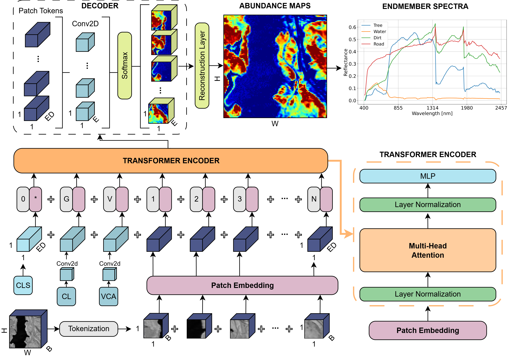

# 🛰️ S3ViT: Self-Supervised Spectral Vision Transformer Framework for Hyperspectral Unmixing



---

## 🧭 Overview

Hyperspectral unmixing aims to decompose each pixel in a hyperspectral image into a set of constituent **endmembers** and their corresponding **abundance fractions**. However, obtaining reliable per-pixel abundance ground truth in real scenes is generally infeasible, which makes supervised learning difficult. In response to this challenge, **S3ViT** is introduced as a **self-supervised Spectral Vision Transformer** for pixel-wise hyperspectral unmixing. :contentReference[oaicite:0]{index=0}

This framework leverages a compact Vision Transformer with **1×1 pixel tokens** to model spectral-spatial dependencies while avoiding the need for manually annotated abundance labels. Instead, it uses weak priors derived from **Singular Value Decomposition (SVD)**, **k-means clustering**, and **Vertex Component Analysis (VCA)** to guide the optimization process. :contentReference[oaicite:1]{index=1}

---

## 🔍 Methodology

The proposed pipeline follows a fully self-supervised unmixing strategy composed of three main stages:

- 🧮 **Endmember estimation via SVD**, used to estimate the number of significant spectral components
- 🧩 **Cluster-derived priors via k-means**, used as weak contextual guidance rather than true supervision
- 🤖 **Spectral Vision Transformer**, operating on **pixel-wise (1×1) tokens** with learnable positional embeddings
- 🛰️ **Special prior tokens**, including **CLS**, **VCA**, and **CL** tokens, injected into the transformer input sequence
- ⚖️ **Physically constrained abundance estimation**, enforcing **non-negativity** and **sum-to-one** through Softmax-based decoding
- 🎯 **Reconstruction-driven optimization**, using spectral reconstruction losses under the Linear Mixing Model (LMM) :contentReference[oaicite:2]{index=2} :contentReference[oaicite:3]{index=3} :contentReference[oaicite:4]{index=4}


The model is evaluated on three standard hyperspectral benchmarks:

- **Samson**
- **Jasper Ridge**
- **Washington DC Mall** :contentReference[oaicite:5]{index=5}

---

## 📊 Key Results

S3ViT achieves **superior or competitive performance** against both geometrical and deep learning baselines across standard benchmark datasets. The paper reports improvements of up to **31% in SAD** and **25% in RMSE**, showing that a compact pixel-token ViT guided by weak spectral priors can achieve strong unmixing performance without ground-truth abundance supervision. :contentReference[oaicite:6]{index=6}

More specifically:

- On **Samson**, S3ViT achieved the best overall accuracy with **mRMSE = 0.0619** and **mSAD = 0.0654**. :contentReference[oaicite:7]{index=7}
- On **Jasper Ridge**, it achieved the best overall spectral fidelity with **mSAD = 0.0232**. :contentReference[oaicite:8]{index=8}
- On **Washington DC Mall**, it delivered the strongest spectral reconstruction with **mSAD = 0.0738**, substantially outperforming competing methods in spectral integrity. :contentReference[oaicite:9]{index=9}

Example Results on Jasper dataset:


---

## 🚀 Usage

### 🔧 Installation

Clone the repository and install the required packages:

```bash
git clone https://github.com/YOUR_USERNAME/s3vit-hyperspectral-unmixing.git
cd s3vit-hyperspectral-unmixing
pip install -r requirements.txt
```

The Python version used in our work is `python==3.9.1`

### 📁 Repository Structure

s3vit-hyperspectral-unmixing/
├── Data/
│   ├── Input/
│   │   └── # Preprocessed `.pt` files containing initialization priors
│   │       # derived from k-means clustering and VCA
│   └── Method_Comparison/
│       ├── dc/
│       │   └── # Abundance maps and endmember spectra for baseline methods
│       ├── jasper/
│       │   └── # Abundance maps and endmember spectra for baseline methods
│       └── samson/
│           └── # Abundance maps and endmember spectra for baseline methods
│
├── datasets/
│   ├── dc/
│   │   └── # Reference abundances and endmembers
│   ├── jasper/
│   │   └── # Reference abundances and endmembers
│   └── samson/
│       └── # Reference abundances and endmembers
│
├── media/
│   └── # Figures and media used in the README
│
├── src/
│   └── # Source code for preprocessing, training, inference, and evaluation
│
├── README.md
└── requirements.txt

### ▶️ Run the Pipeline on your data

1. Be sure to put all your UAV videos in the `Caustics_Removal` folder.
2. Put your ground truth image in the `Caustics_Removal/5_Target` fodler. For more details on the GT iamge selection, look at our paper.
3. Run the `CV_Caustics_Removal.jpynb` notebook. The folder structure is already given in the repository.

## 📖 Cite Us

If you use this repository or the methods described herein in your work, please cite it as follows.
[Link](https://ieeexplore.ieee.org/abstract/document/11075526) to the article.
**BibTeX**
```bibtex
@ARTICLE{11075526,
  author={Scilla, Dario and Lopez, Omar A. and Nieuwenhuis, Brian Owain and Johansen, Kasper and Elías-Lara, Mariana and Angulo, Victor and Rodríguez, Jorge L. and Jones, Burton H. and McCabe, Matthew F.},
  journal={IEEE Journal of Selected Topics in Applied Earth Observations and Remote Sensing}, 
  title={Computer Vision Corrections Enhance UAV-Based Retrievals in Shallow Waters}, 
  year={2025},
  volume={18},
  number={},
  pages={18134-18149},
  keywords={Image color analysis;Autonomous aerial vehicles;Optical distortion;Sun;Marine vegetation;Distortion;Videos;Shape;Water conservation;Sea measurements;Caustics;color transferring;computer vision;refraction;shallow waters;unmanned aerial vehicle (UAV)},
  doi={10.1109/JSTARS.2025.3587478}}