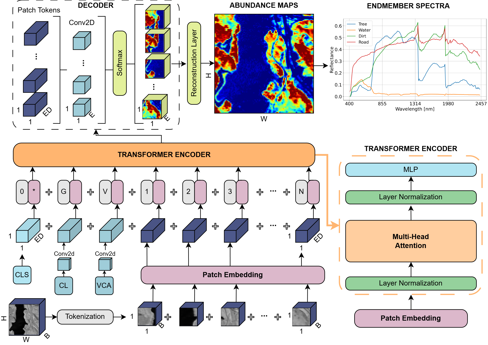
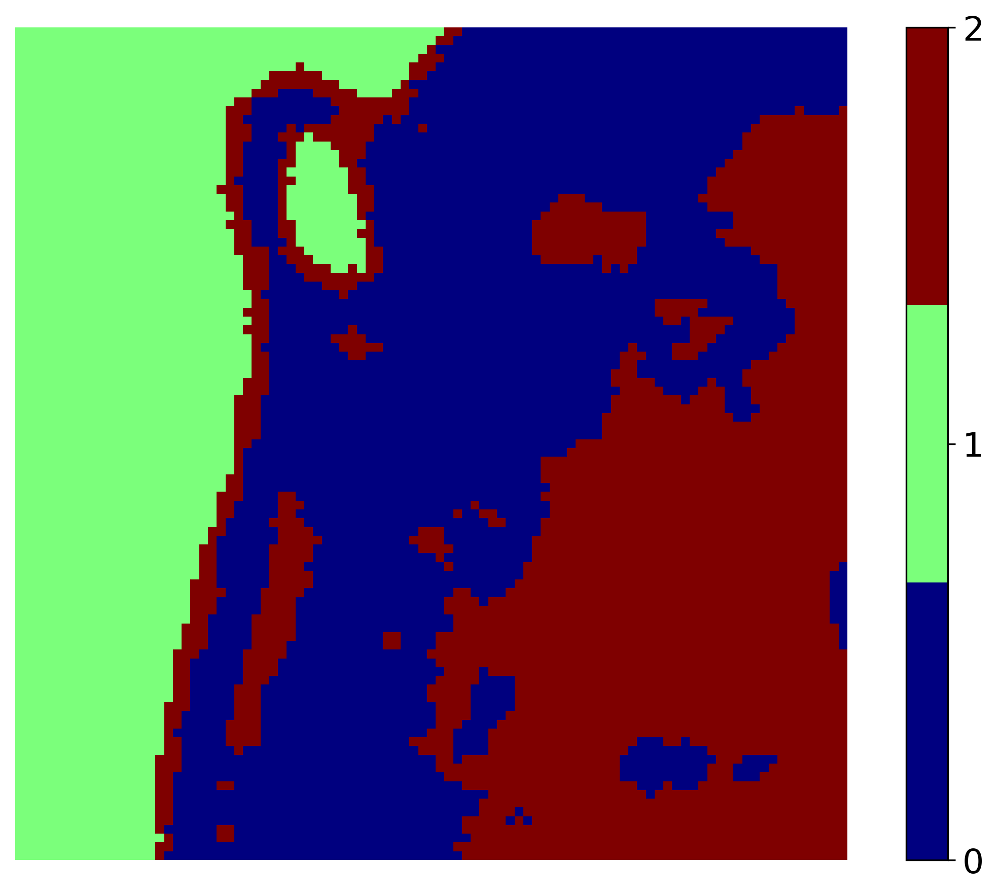
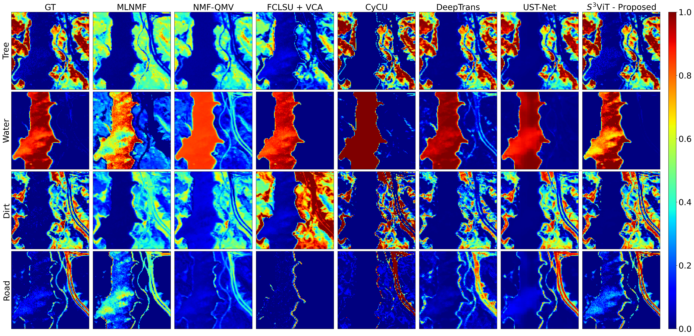
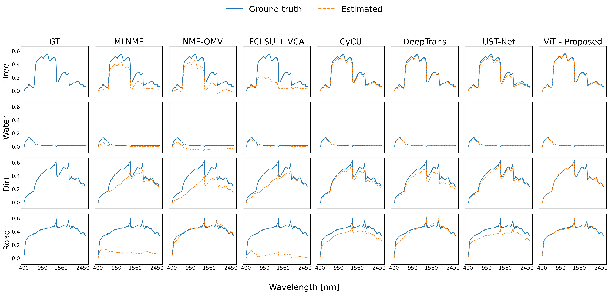

# 🛰️ S3ViT: Self-Supervised Spectral Vision Transformer Framework for Hyperspectral Unmixing



---

## 🧭 Overview

Hyperspectral unmixing aims to decompose each pixel in a hyperspectral image into a set of constituent **endmembers** and their corresponding **abundance fractions**. However, obtaining reliable per-pixel abundance ground truth in real scenes is generally infeasible, which makes supervised learning difficult. In response to this challenge, **S3ViT** is introduced as a **self-supervised Spectral Vision Transformer** for pixel-wise hyperspectral unmixing.

This framework leverages a compact Vision Transformer with **1×1 pixel tokens** to model spectral-spatial dependencies while avoiding the need for manually annotated abundance labels. Instead, it uses weak priors derived from **Singular Value Decomposition (SVD)**, **k-means clustering**, and **Vertex Component Analysis (VCA)** to guide the optimization process.

---

## 🔍 Methodology

The proposed pipeline follows a fully self-supervised unmixing strategy composed of three main stages:

- 🧮 **Endmember estimation via SVD**, used to estimate the number of significant spectral components
- 🧩 **Cluster-derived priors via k-means**, used as weak contextual guidance rather than true supervision
- 🤖 **Spectral Vision Transformer**, operating on **pixel-wise (1×1) tokens** with learnable positional embeddings
- 🛰️ **Special prior tokens**, including **CLS**, **VCA**, and **CL** tokens, injected into the transformer input sequence
- ⚖️ **Physically constrained abundance estimation**, enforcing **non-negativity** and **sum-to-one** through Softmax-based decoding
- 🎯 **Reconstruction-driven optimization**, using spectral reconstruction losses under the Linear Mixing Model (LMM)



The model is evaluated on three standard hyperspectral benchmarks:

- **Samson**
- **Jasper Ridge**
- **Washington DC Mall**

---

## 📊 Key Results

S3ViT achieves **superior or competitive performance** against both geometrical and deep learning baselines across standard benchmark datasets. The paper reports improvements of up to **31% in SAD** and **25% in RMSE**, showing that a compact pixel-token ViT guided by weak spectral priors can achieve strong unmixing performance without ground-truth abundance supervision.

More specifically:

- On **Samson**, S3ViT achieved the best overall accuracy with **mRMSE = 0.0619** and **mSAD = 0.0654**.
- On **Jasper Ridge**, it achieved the best overall spectral fidelity with **mSAD = 0.0232**.
- On **Washington DC Mall**, it delivered the strongest spectral reconstruction with **mSAD = 0.0738**, substantially outperforming competing methods in spectral integrity.

Example Results on Jasper dataset:



---

## 🚀 Usage

### 🔧 Installation

Clone the repository and install the required packages:

```bash
git clone https://github.com/YOUR_USERNAME/s3vit-hyperspectral-unmixing.git
cd s3vit-hyperspectral-unmixing
pip install -r requirements.txt
```

The Python version used in our work is `python==3.9.1`

### 📁 Repository Structure

```text
s3vit-hyperspectral-unmixing/
├── Data/
│   ├── Input/
│   │   └── Preprocessed `.pt` files containing initialization priors
│   │       derived from k-means clustering and VCA
│   └── Method_Comparison/
│       ├── dc/
│       │   └── Abundance maps and endmember spectra for baseline methods
│       ├── jasper/
│       │   └── Abundance maps and endmember spectra for baseline methods
│       └── samson/
│           └── Abundance maps and endmember spectra for baseline methods
├── datasets/
│   ├── dc/
│   │   └── Reference abundances and endmembers
│   ├── jasper/
│   │   └── Reference abundances and endmembers
│   └── samson/
│       └── Reference abundances and endmembers
├── media/
│   └── Figures and media used in the README
├── src/
│   └── Source code for preprocessing, training, inference, and evaluation
├── README.md
└── requirements.txt
```

- **Data/Input/** contains the preprocessed `.pt` files generated by the preprocessing scripts. These files store the initialization priors derived from **k-means clustering** and **Vertex Component Analysis (VCA)**.
- **Data/Method_Comparison/** contains, for each benchmark dataset, the abundance maps and endmember spectra obtained from the state-of-the-art baseline methods used in the paper.
- **datasets/** contains one folder for each benchmark dataset used in this work: **Samson**, **Jasper Ridge**, and **Washington DC Mall (dc)**. These folders include the original reference abundance maps and endmember spectra used for evaluation.
- **src/** contains all source scripts for preprocessing, model training, inference, evaluation, and visualization.

---

### ▶️ Running the Pipeline

To reproduce the experiments:

1. Place each benchmark dataset in its corresponding folder under `datasets/`:
   - `datasets/samson/`
   - `datasets/jasper/`
   - `datasets/dc/`

2. Run the preprocessing scripts from the `src/` directory to generate the `.pt` initialization files stored in:

   - `Data/Input/`

   These files contain the initialization priors obtained from:
   - **Singular Value Decomposition (SVD)**
   - **k-means clustering**
   - **Vertex Component Analysis (VCA)**

3. Run the training and inference scripts from the `src/` directory.

4. For comparison against existing methods, use the files available in:

   - `Data/Method_Comparison/`

   This directory contains the abundance maps and endmember spectra of the baseline methods reported in the paper.

---

## 📦 Requirements

A typical `requirements.txt` for this repository is:

```txt
numpy>=1.23
scipy>=1.10
scikit-learn>=1.2
matplotlib>=3.7
seaborn>=0.12
tifffile>=2023.0.0
rasterio>=1.3
torch>=2.0
torchvision>=0.15
```

Install them with:

```bash
pip install -r requirements.txt
```

---

## 🧪 Datasets

This work uses three standard hyperspectral benchmark datasets:

- **Samson**
- **Jasper Ridge**
- **Washington DC Mall**

The corresponding reference abundance maps and endmember spectra are stored in the `datasets/` directory and are used for quantitative evaluation.

---

## 📈 Evaluation

The model is evaluated using two standard metrics:

- **RMSE** for abundance estimation
- **SAD** for endmember spectral reconstruction

The manuscript compares S3ViT against representative geometrical and deep learning baselines, including:

- **MLNMF**
- **NMF-QMV**
- **FCLSU + VCA**
- **CyCU-Net**
- **DeepTrans**
- **UST-Net**

---

## 📝 Notes

- `samson`, `jasper`, and `dc` correspond to the three benchmark datasets used in the manuscript.
- The reference abundances and endmember spectra provided under `datasets/` are used for evaluation and quantitative comparison.
- All implementation scripts are contained in the `src/` directory.
- The `.pt` files in `Data/Input/` are preprocessing outputs required by the training pipeline.

---

## 📄 Citation

If you use this repository in your research, please cite the corresponding paper:

```bibtex
@article{scilla2026s3vit,
AUTHOR={Scilla, Dario  and Angulo, Victor  and Johansen, Kasper  and Alsalem, Naif  and Heidrich, Wolfgang  and McCabe, Matthew F. },          
TITLE={S3ViT: self-supervised spectral vision transformer framework for hyperspectral unmixing},   
JOURNAL={Frontiers in Remote Sensing},         
VOLUME={Volume 7 - 2026},
YEAR={2026},
URL={https://www.frontiersin.org/journals/remote-sensing/articles/10.3389/frsen.2026.1812755},
DOI={10.3389/frsen.2026.1812755},
ISSN={2673-6187}}
```